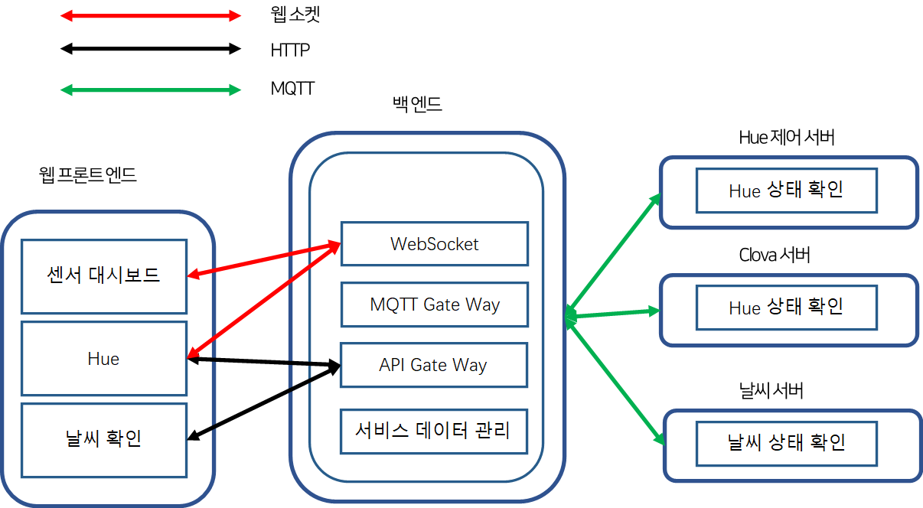

# 스마트 홈 프로젝트 설명

## 1. 구조

* 현재 저장소에 포함된 모듈
  + Hue 
  + Weather 
  + Clova 
  + App BackEnd
  + App FrontEnd
  
  

* 각각의 모듈은 별개의 저장소에 관리되었으나 최종 업로드는 1개의 파일로 구성하였습니다
* 센서 구동 코드는 현재 저장소에 포함되어 있지 않습니다

## 2. Hue 
    Hue 모듈은 Philips Hue 장비를 원격 제어하는 모듈입니다. app backend와 mqtt 방식으로 통신합니다

## 3. Weather
    Weather 모듈은 공공데이터 포털에서 제공하는 날씨 정보를 가공하여 app backend에 전달하는 모듈입니다.
    app backend와 mqtt 방식으로 통신합니다

## 4. Clova
    Clova 모듈은 Hue의 음성 제어를 위해 설치한 모듈입니다. 현재 Hue가 설치된 위치, 각 위치 별 Hue의 상태 확인 및 제어를 담당합니다. app backend와 mqtt 방식으로 통신합니다

## 5. App BackEnd
    App BackEnd는 다른 센서 모듈과 장비 모듈과의 통신을 총괄하며 전달 받은 센서 값을 분류해 App FrontEnd로 전달하거나 알람 확인하는 역할을 담당합니다. App FrontEnd와는 Http 또는 WebSocket 방식을 이용하며 나머지 모듈과는 mqtt 방식을 이용해 통신합니다.

## 6. App FrontEnd
    App FrontEnd는 현재 센서의 정보를 실시간으로 확인할 수 있습니다. 또한 현재 설치된 장비를 사용자의 편의에 따라 설정할 수 있으며 알람 또는 연동 설정을 진행할 수 있는 UI를 제공합니다